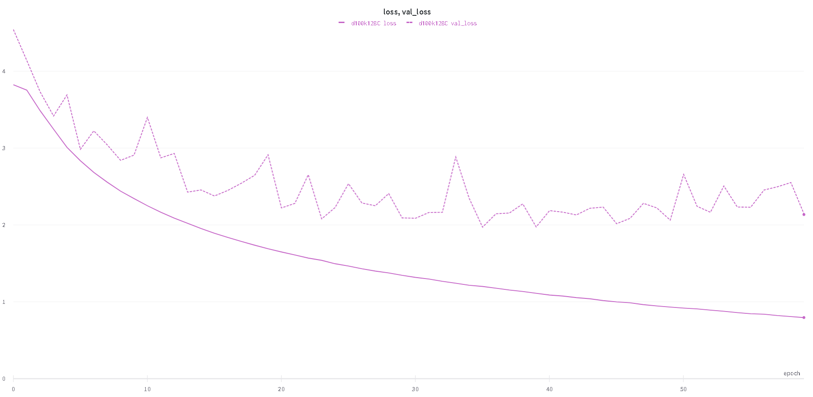
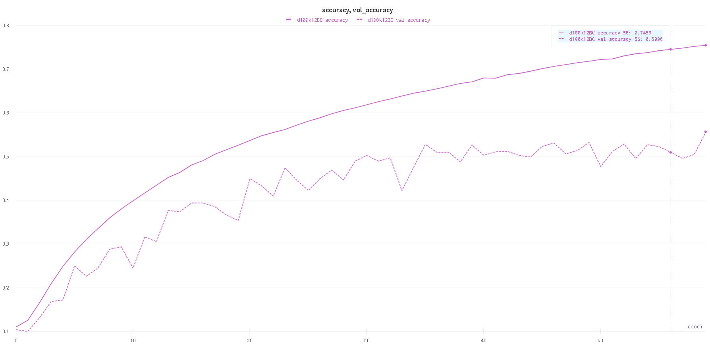

# CIFAR10
Analysis of models and implementation different algorithms with aim to improve state of art results on CIFAR-10 dataset. This is a playground for experimenting and implementing new things I learn.
Although it is named CIFAR10 but all the experiments and models are run on CIFAR100 because next step will be transfer model to CIFAR10.
This is my playtime repo and ecery tab below gives the idea about decision in that sphere of model.

# Result 
Weights and Bias run: [here](https://wandb.ai/tnzl/dense-net-implementation?workspace=user-tnzl)\
\

# Models
Model graph: [here](https://wandb.ai/tnzl/dense-net-implementation/runs/d100k12BC/model?workspace=user-tnzl)\
** Remove this line: Relatively light weight model to be chosen in order to apply **

Simple CNN: Enhanced Image Classification With a Fast-LearningShallow Convolutional Neural Network
https://arxiv.org/pdf/1503.04596.pdf

Resnet: Deep Residual Learning for Image Recognition https://arxiv.org/pdf/1512.03385.pdf

Read following if time.
Convolutional Kernel Networks
https://arxiv.org/pdf/1406.3332.pdf

# Training
    1. Batch Normalization 
    2. Transfer Learning: Deep Convolutional Neural Networks asGeneric Feature Extractors
    https://www.isip.uni-luebeck.de/fileadmin/uploads/tx_wapublications/hertel_ijcnn_2015.pdfa
    Pre-train on MNIST maybe or some else dataset.
    3.
   
# Weight  initialisation and activation function
    Kaiming init weights and relu activate
  

# Overfitting
    1. Image augmentation 
    2. Regularization 
    3. Dropout
    4. Stochastic Pooling for Regularization ofDeep Convolutional Neural Networks https://arxiv.org/pdf/1301.3557.pdf 
    5. Fractional Max-Pooling: https://arxiv.org/pdf/1412.6071.pdf This because maxpooling gives spatial loss
    
# Hyperparameter tuning/ Optimization
    1. Practical Bayesian Optimization of MachineLearning Algorithms: http://papers.nips.cc/paper/4522-practical-bayesian-optimization-of-machine-learning-algorithms.pdf
  

# Visualization
    1. Convolution layer visualization 
    2. pca or tSNE
    3. Clusterrning using knn. Create 3d graph using PCA to visualize it.
    4. Confusion matrix

# REFERENCES
* Dataset: https://www.cs.toronto.edu/~kriz/cifar.html
* Blog: https://blog.keras.io/how-convolutional-neural-networks-see-the-world.html on visualizing convolution layers.
* Guide: http://karpathy.github.io/2019/04/25/recipe/ A Recipe for Training Neural Networks
